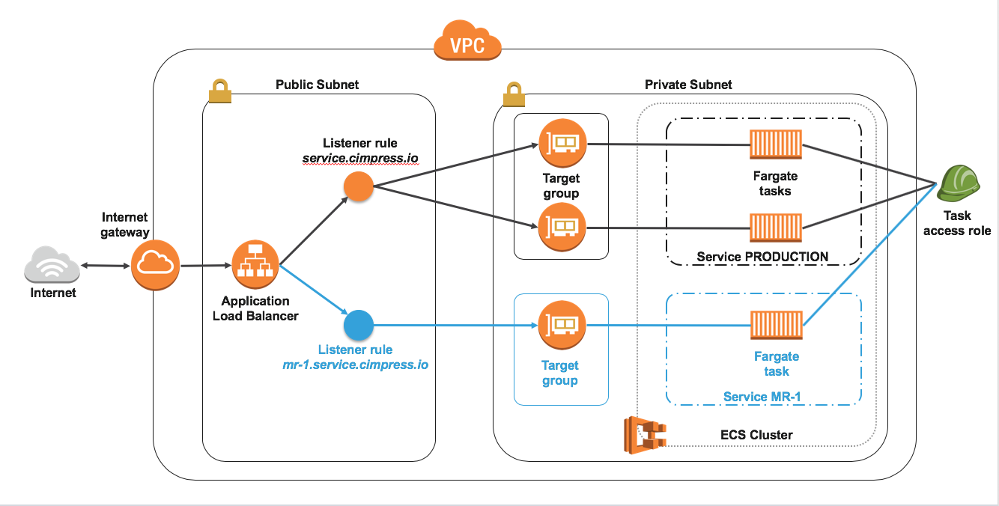

# CloudFormation templates for AWS Fargate deployment
The repository contains infrastructure files which can be used to bootstrap supporting infrastrcture for AWS Fargate task deployments. The Fargate task CloudFormation template is also provided.

The architecture deployed by these templates is following:

## Credits
Some parts were adapted from: https://github.com/nathanpeck/aws-cloudformation-fargate/